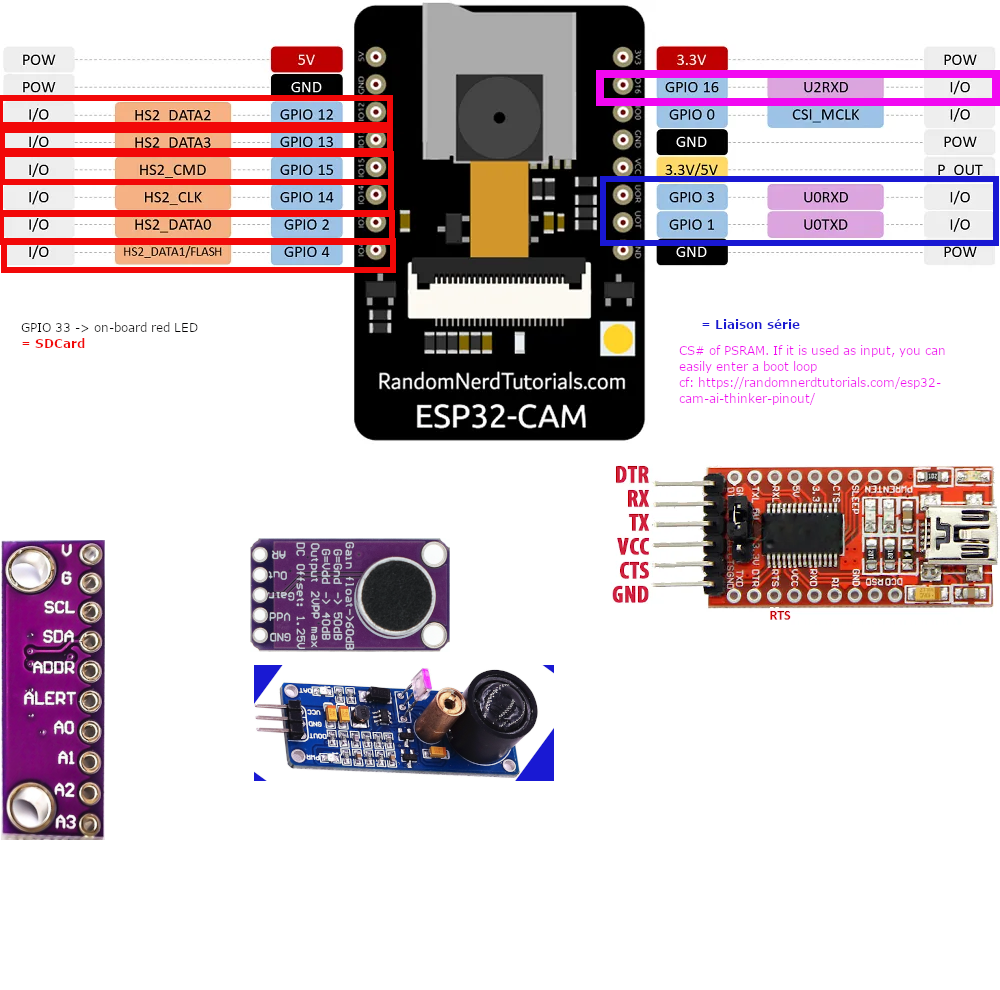

# Detecteur-ESP32-Cam : Blob Detector Localisator

## Découpe des tâches à effectuer

- [x] [Détection acoustique du vol du frelon asiatique](./sketchbook/ESP_CAM_Audio_Detection): Vespa Velutina Nigrithorax (ESP32-Cam).

- [x] Détection et prise de photo du frelon asiatique en vol stationnaire en moins d'une seconde (ESP32-Cam).

- [x] Localisation d'un Blob dans une photo JPEG/jpg en 180ms pour une résolution 320x240 pixels (ESP32-Cam).

- [x] Détection de la tâche la plus sombre de l'image (ESP32-Cam).

- [x] Déduction coordonnées/angles des servos pour actionner un pan/tilt (ESP32-Cam).

- [x] Transmission de l'ordre de déplacement du pan/tilt: un angle pour chacun des deux servos du pan/tilt (ESP32-Cam).

- [x] [Réception/écoute du port série](./sketchbook/CoordonneesSerie) pour récupérer les valeurs des angles (Arduino 3.3V)

- [x] Déplacement des servos alimentés et controllés par PCA9695 (Arduino 3.3V)

- [x] Écoute du capteur d'obstacle laser (Arduino 3.3V)

- [x] Actionnement d'une électrovanne via relais (Arduino 3.3V)

- [ ] Assembler les sections correspondantes dans un programme pour l'ESP32-Cam

- [ ] Assembler les sections correspondantes dans un programme stable l'Arduino

- [ ] Tester en conditions réelles

- [ ] Corriger/adapter/améliorer/pleurer :D

## Présentation du projet

Après analyse des fréquences émises lors du vol stationnaire du frelon devant une ruche,
nous avons mis au point un filtre FFT qui donne satisfaction puisqu'il a permis de détecter des frelons dans 5 sites différents en France durant l'été 2020 : Limoux, Limoges, Toulouse, Nice et Caen.

Afin de valider le filtre acoustique, nous avons réalisé un programme s'executant sur un ESP32-Cam muni d'un micro (sur son unique entrée dispo ou presque: GPIO0) pour faire un photo de l'intrus, cette détection s'effectue en moins d'une seconde.

La prise de la photo, son analyse pour déduire la localisation du frelon est quant à elle réalisée en moins de 300ms (nb: en direct par l'ESP32-CAM).

### Principe d'analyse de l'image

L' analyse de la photo est basée sur le contraste et la taille d'une zone sombre (blob):

- La photo est prise depuis le dessus de la ruche en plongée devant un écran blanc.

- Les frelons, les abeilles et les résidus parsèment la photo et le pixel le plus noir n'est pas forcement la cible.

Toutefois en agglomérant des blocs de 4x4 pixels, on obtient des blobs dont le plus sombre est possiblement notre frelon:
plus gros qu'une abeille et plus noir/sombre qu'une feuille.

### Action !
Les coordonnées sont déduites de l'image et sont transmises à un Pan-Tilt guidé par un Arduino et équipé d'un dispositif de riposte (bille, eau, laser ...).

Il y a deux solutions en cours de recherche :

1.  Un ESP32-CAM détecte acoustiquement le Frelon asiatique, prend la photo en 320x240, l'analyse et transmet les coordonnées à un Arduino qui anime un Pan-Tilt équipé d'un laser. Actuellement c'est la solution explorée, la détection prend moins d'une seconde et la localisation 300ms.

2. un ESP32 équipé d'un Shield OV7670 et d'un Shield SD, détecte le frelon, prend la photo en 80x60, l'analyse et anime le Pan-Tilt équipé du laser.

Ce qui est fait :

- [x] la détection
- [x] la prise de photo
- [x] l'analyse et la localisation en pixel dans la photo

- [x] La détection par FFT et la sauvegarde sur carte SD : [ESP_CAM_timelapse_detector_Etienne_0.ino](./sketchbook/ESP_CAM_timelapse_detector_Etienne_0/ESP_CAM_timelapse_detector_Etienne_0.ino)

- [x] L'analyse en partant des photos mises en mémoires SPIFFS et la localisation du Blob : [decoder_jpeg_08_1.ino](./sketchbook/decoder_jpeg_08_1/decoder_jpeg_08_1.ino)

- [x] La prise de photo et l'analyse de blob grâce à l'excellent EloquentArduino :
https://github.com/eloquentarduino/EloquentArduino

et son example : https://eloquentarduino.github.io/2020/01/motion-detection-with-esp32-cam-only-arduino-version/

- [x] Une détection d'un blob 4x4 dans une photo 320x240 en 180ms !!! = : ESP32CameraNaiveMotionDetection_1.ino
- [x] envoyer et recevoir les coordonnées  de l'[ESP32-CAM à l'Arduino via Tx-Rx](./sketchbook/ESP_CAM_Audio_Detection)

Ce qu'il reste à faire :

- [ ] déclencher le tir du laser 10W alimenté en 12v 5A !!!
- [x] sauver la photo avec les coordonnées du tir pour la postérité.

La logique actuellement est la suivante :
- quand on allume l'esp32-cam
  1. il lit l'EEProm pour savoir à quel numéro de fichier il en est : xxx
  2. il fait une localisation qu'il sauvegarde sur la carte SD : fichier LOCAxxx.txt

 Reste à faire : transmettre l'information au Pan-Tilt

  3. il fait une photo sauvegardée sur la carte SD : fichier CAPTURExxx.jpg
  4. il se met en position d'écoute sur le port 0
  5. il fait la FFT
  6. si le filtre de la FFT est positif, il commence à compter
  7. si le compteur du filtre atteint 5 reconnaissances en moins d'une seconde
        il collecte les 5 FFT qui ont déclenchées l'alarme et les stocke sur la carte SD : fichier FFTxxx.txt
        puis l'esp32-cam redémarre pour faire la localisation et la photo
  8. sinon il recommence en -4

Cette nouvelle version ["ESP_CAM_detector_localisor_Patrick_0_1"](./sketchbook/ESP_CAM_detector_localisor_Patrick_0_1/ESP_CAM_detector_localisor_Patrick_0_1.ino) (en hommage à Patrick DESSEAUX qui m'aide beaucoup)
marque un tournant dans la détection : après son analyse, seule la première harmonique est testée : 230Hz +/- 10%.

Et sans doute allons-nous modifier aussi le dispositif suivant son idée : un micro sur le devant de la ruche et un micro d'ambiance,
afin de supprimer les faux positifs dus à l'environnement (mobylette et autres..) et donc raccourcir le temps de détection.

## Le canon à bille de Ptilab: la solution la plus prometteuse !

Un canon a été experimenté avec succés par Ptitlab et son ami bbruno:

Depuis 2017 ils tirent le frelon :  https://drive.google.com/file/d/16ssjIsU98TqoQO_uRPv50JdfcAjg1aXl/view?usp=sharing

Plus de renseignements sur : http://ruchewarre.net/viewtopic.php?f=175&t=10218
Nous attendons beaucoup de cette collaboration.

Si vous avez des idées pour tuer les frelons asiatiques, merci de nous en faire part

Merci à tous

# Documentation

## Composants

[Liste des composants](documentation/Composants.md)

## Schema des connections ESP32-Cam

## Essais laser
[Essais laser](documentation/Laser.md)

## Quelques images capturées

### Frelons

### Frelon ?

## Enregistrements audio

[bruit_rue+frelon_1](Son-2019-08-16-09-39_bruit_rue+frelon_1.wav)

[bruit_rue+frelon_2](Son-2019-08-16-09-39_bruit_rue+frelon_2.wav)